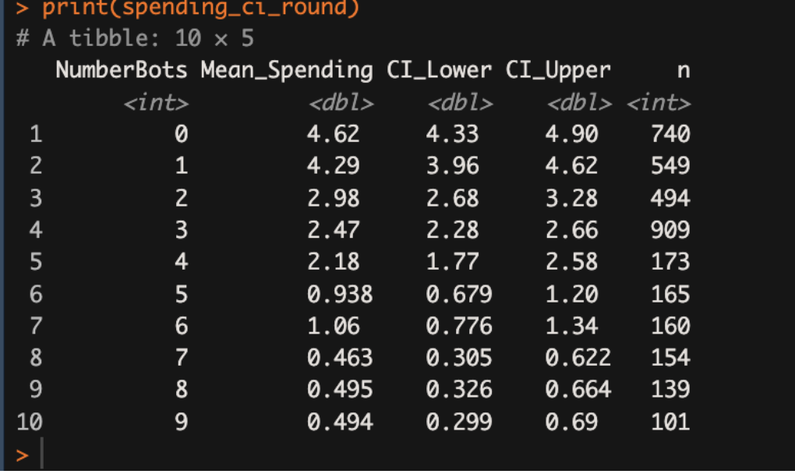
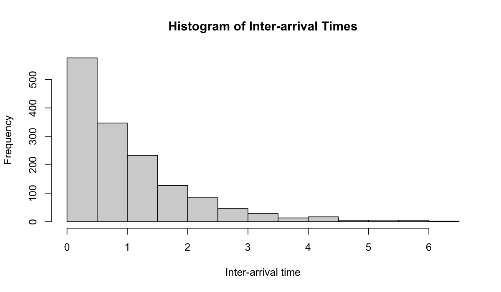
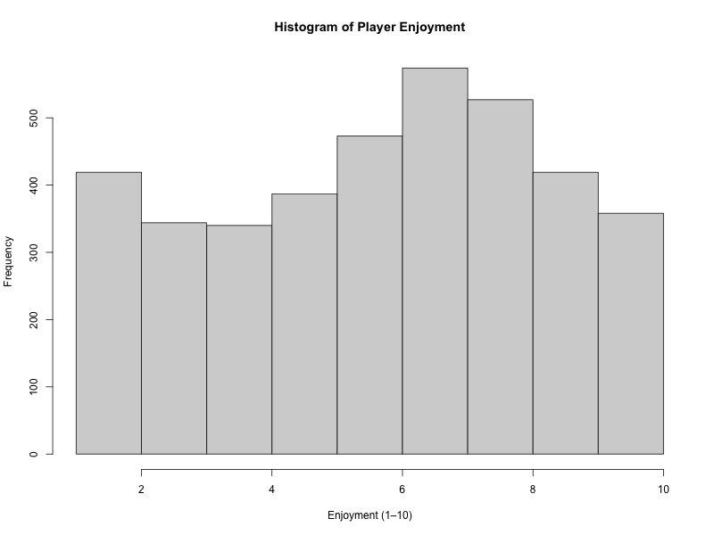
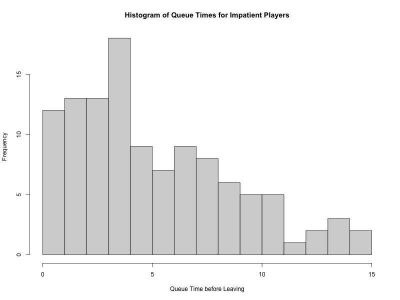

# Gaming Platform Player Behaviour & Revenue Analysis
**Statistical Analysis | Distribution Fitting | Confidence Intervals | R**

---

## Executive Summary

A hypothetical online multiplayer gaming platform was experiencing lower than expected in-game revenue and needed to understand what was driving player spending behaviour. This analysis examined four key areas: the impact of bots on player spending, player arrival patterns, in-game spending and enjoyment distributions, and the effect of queue abandonment on platform data.

Key finding: **Players in fully human games (0 bots) spent on average $4.62, nearly 10x more than players in games with 9 bots ($0.49)**. The confidence intervals do not overlap, confirming this is a statistically meaningful difference, not random noise.

**Recommended next steps for the platform product team:**
- Prioritise matchmaking speed to reduce bot frequency, the revenue impact is significant and quantifiable
- Use the exponential inter-arrival model (λ = 0.9915) to build more accurate queue simulations
- Address the truncated impatience data problem before building any player retention models

---

## Business Problem

Online gaming platforms generate revenue through in-game purchases. This platform noticed lower conversion rates than expected and needed a data-driven understanding of what affects how much players spend.

***Does the number of bots in a game room affect how much money players spend? How should the platform model player arrivals, spending, and enjoyment for future simulation and planning?***

Answering these questions gives the product and revenue teams a statistical foundation for matchmaking decisions, queue design, and simulation input modelling, moving beyond gut instinct to evidence-based product strategy.

**Primary stakeholder:** Product managers and revenue analysts at the gaming platform who need to understand the drivers of in-game spending and how to improve conversion.

---

## Methodology

This project analysed four datasets covering player inter-arrival times, multiplayer game data (spending, enjoyment, bots), and single-player queue abandonment data.

**Approach:**
1. **Bot impact on spending**: Constructed 95% confidence intervals for average player spending across all bot counts (0–9) using only non-impatient players, and assessed whether differences were statistically meaningful
2. **Inter-arrival time distribution fitting**: Built a histogram of player inter-arrival times, identified the exponential distribution as the best candidate, estimated the rate parameter using MLE, and validated the fit using a Chi-squared goodness of fit test (10 equal probability bins, α = 0.05)
3. **Spending & enjoyment distribution selection**: Analysed histograms of both variables and recommended the most appropriate simulation input method (direct sampling, empirical, or theoretical distribution) for each
4. **Impatience data bias analysis**: Examined the truncated nature of queue abandonment data and assessed the implications for simulation accuracy

---

## Skills

**R Studio:**
- Confidence interval construction using `t.test()` and manual CI calculation
- Histogram visualisation with `hist()`
- Chi-squared goodness-of-fit testing using `chisq.test()` and manual bin calculation
- MLE parameter estimation for exponential distribution
- Data filtering and subsetting with `dplyr`
- CDF-based bin edge calculation using `qexp()`

**Statistical Concepts:**
- Confidence interval interpretation and non-overlapping CI logic
- Distribution selection and justification (exponential, empirical, theoretical)
- Chi-squared goodness-of-fit testing
- Maximum Likelihood Estimation (MLE)
- Truncated data and selection bias
- Zero-inflated distributions and mixed modelling approaches

---

## Results & Business Recommendations

### Bot Count vs. Player Spending

The analysis confirmed that bots have a strong negative effect on revenue. Players in games with no bots spent an average of **$4.62 (95% CI: $4.33–$4.90)**, while players in games with 9 bots spent an average of just **$0.49 (95% CI: $0.30–$0.69)**. Crucially, the confidence intervals across bot groups do not overlap, making this finding statistically significant.

*95% confidence intervals for average player spending by number of bots. The clear downward trend confirms that more bots means significantly less revenue per player.*

**Recommendation:** Reducing average bot count per game should be treated as a revenue priority. Even reducing average bots from 5 to 2 is associated with roughly doubling average spend per player. Faster matchmaking that fills rooms with real players is the most direct lever the product team has.

---

### Player Inter-Arrival Times

The inter-arrival time histogram showed a right-skewed, memoryless distribution consistent with a Poisson arrival process.

*Strongly right-skewed distribution consistent with an exponential model. Players arrive independently and randomly.*

An exponential distribution with **λ = 0.9915** (mean inter-arrival time ≈ 1 minute) was fitted using MLE. A Chi-squared goodness of fit test returned a test statistic of **3.39**, well below the critical value of **15.51** (df = 8, α = 0.05), with a p-value of 0.9076. The exponential distribution is a good fit and should be used as the arrival input for any queue simulation.

---

### Player Enjoyment & Spending Distributions

**Player Enjoyment — Empirical Distribution recommended**

*Enjoyment scores (1–10) follow a roughly unimodal shape with a slight spike at low scores. The bounded integer scale makes an empirical distribution the best simulation input.*

Enjoyment is a bounded integer (1–10) with a clear shape that doesn't map cleanly to a standard theoretical distribution. An empirical distribution captures the observed proportions directly and is flexible enough for simulation without overfitting to noise.

**Player Spending — Mixed Theoretical/Empirical Distribution recommended**

*The majority of players spend nothing, creating a zero-inflated distribution. A single theoretical distribution cannot capture this shape.*

The spending data is zero-inflated: most players spend $0, whilst a small proportion spend varying amounts. The recommended approach is a two-stage model: first simulate whether a player spends at all using a Bernoulli distribution, then apply an empirical distribution to model the amount spent by those who do spend. This mixed approach produces a far more realistic simulation than any single distribution.

---

### Impatience Data & Truncation Bias

*Queue abandonment times for players who left early. This dataset only captures players who left, not those who waited and played.*

The impatience dataset is a **truncated sample**. It only includes players who gave up, not those who waited successfully. Fitting a distribution to this data alone would underestimate true queue times and overestimate abandonment rates, leading to simulations that exaggerate player churn. Any simulation using this data needs to account for the full player population, not just those who abandoned.

---

## Next Steps & Limitations

**Limitations:**
- The dataset is hypothetical, which limits real-world validation of findings
- Spending analysis is correlational. We cannot conclude bots *cause* lower spending without controlling for confounders (e.g. game quality, player skill level)
- The impatience data is truncated and cannot be used in isolation for retention modelling

**If I had more time / data:**
- Build a regression model to quantify the relationship between bot count and revenue while controlling for other variables
- Conduct formal goodness of fit testing for the spending and enjoyment distributions to validate the recommended simulation inputs
- Combine the multiplayer and single-player datasets to model the full player journey from arrival to spending outcome
- Build an interactive Shiny dashboard to allow the product team to explore spending by bot count and simulate revenue under different matchmaking scenarios
  
---

*Analysis completed as part of BUSAN 305: Simulation Modelling, University of Auckland, Semester 2 2025.*
